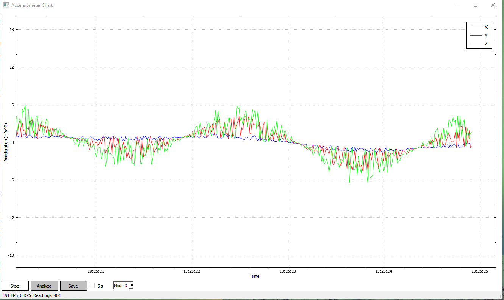

# CIC-localization
The localization system is divided into two parts, the hardware and software. The hardware composes of the beacon nodes, the gateway, and the tag node. The software composes of the environment configuration, the GUI, and the localization core. In the following, we will introduce them one by one.

This is a simple GUI software to monitor each accelerometer sensor data(X,Y,Z) on the beacon nodes.

